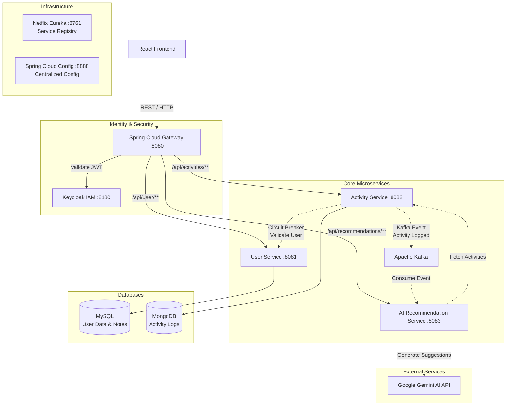

# High-Level Design (HLD): Fitness Tracker & AI Suggestions Microservices

## 1. System Overview
This project is an enterprise-grade, distributed microservices application designed to track user fitness activities, manage personal notes, and provide AI-driven health and diet recommendations. The architecture is highly scalable, fault-tolerant, and secure, utilizing Spring Boot, Spring Cloud, and Keycloak for Identity and Access Management.

## 2. Architecture Diagram

## 3. Core Components

### 3.1. Infrastructure Services
- **Spring Cloud Gateway (Port 8080):** The single entry point into the system. Handles routing, CORS, and stateless JWT validation before forwarding requests to the internal microservices. It extracts the `X-User-Id` from the Keycloak token and injects it into downstream requests for secure user identification.
- **Netflix Eureka (Port 8761):** The Service Registry. All microservices register themselves here, allowing the Gateway and other services to discover them dynamically without hardcoded IP addresses.
- **Spring Cloud Config (Port 8888):** Centralized configuration server. It serves externalized configuration properties to all microservices, ensuring consistency across environments.

### 3.2. Business Microservices
- **User Service (Port 8081):** Manages user profiles, synchronization with Keycloak, and personal user notes. Connects to a relational **MySQL** database.
- **Activity Service (Port 8082):** Handles logging and retrieving physical activities, and calculating 7-day rolling performance metrics. Connects to **MongoDB** (NoSQL) to allow flexible schemas for various types of workouts. Implements **Resilience4j** circuit breakers for user validation and publishes asynchronous events to **Apache Kafka** upon new workout logs.
- **AI Recommendation Service (Port 8083):** Acts as the AI brain of the application. Listens to Kafka topics to generate tailored fitness and diet advice asynchronously via the Google Gemini API. Manages dynamic **Resilience4j Rate Limiting** buckets to strictly enforce usage quotas for "Free" vs "Custom" API Keys.

### 3.3. Identity and Access Management
- **Keycloak (Port 8180):** A robust open-source IAM solution handling user registration, authentication, Identity Brokering (e.g., Google Sign-In), and Role-Based Access Control (RBAC). It issues standard JSON Web Tokens (JWTs) used by the entire system.

## 4. API Documentation (Swagger/OpenAPI)
To facilitate easy testing and integration, **Swagger UI** (via `springdoc-openapi`) is embedded directly into each business microservice. Once the servers are running, you can access the interactive API documentation at:
- **UserService:** `http://localhost:8081/swagger-ui.html`
- **ActivityService:** `http://localhost:8082/swagger-ui.html`
- **AiService:** `http://localhost:8083/swagger-ui.html`

## 5. Design Decisions & Trade-offs
- **Polyglot Persistence:** We chose MySQL for user data to ensure strict ACID compliance and relational integrity. We chose MongoDB for activities because workout metrics vary wildly (e.g., swimming vs. weightlifting), requiring a schema-less NoSQL document structure.
- **Stateless Authentication:** By validating JWT signatures at the Gateway, we avoid constant database lookups for session validation, massively improving scalability.
- **Synchronized User IDs:** To bridge the gap between Keycloak and local databases, the Keycloak `sub` (UUID) is seamlessly synchronized and used as the Primary Key in the MySQL database, ensuring zero mapping overhead.
