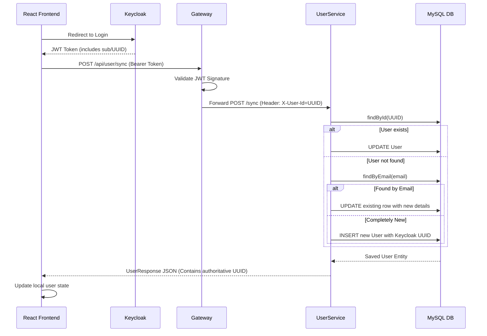
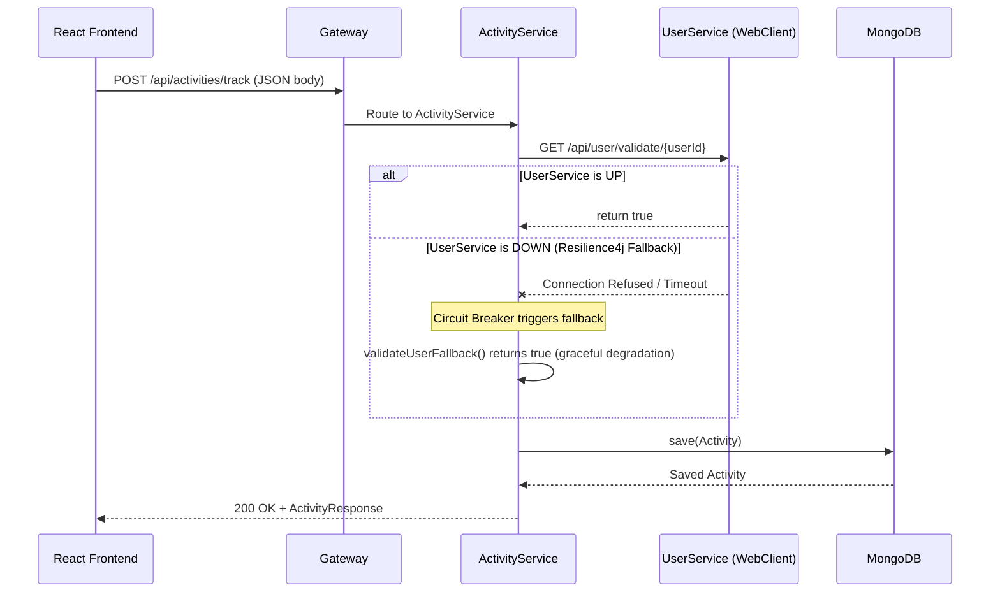

# Low-Level Design (LLD): Fitness Tracker & AI Suggestions Microservices

## 1. Database Schemas

### 1.1. MySQL (User Service)
**Table: `fitness_user`**
| Column | Type | Constraints | Description |
|--------|------|-------------|-------------|
| `id` | VARCHAR(36) | PRIMARY KEY | The exact UUID provided by Keycloak. |
| `email` | VARCHAR(255) | UNIQUE, NOT NULL | User's email address. |
| `first_name` | VARCHAR(100)| NOT NULL | User's first name. |
| `last_name` | VARCHAR(100) | | User's last name. |
| `password` | VARCHAR(255) | NOT NULL | Placeholder (`OIDC_USER`). Real password in Keycloak. |
| `role` | VARCHAR(20) | NOT NULL | User role (e.g., `USER`, `ADMIN`). |

**Table: `user_note`**
| Column | Type | Constraints | Description |
|--------|------|-------------|-------------|
| `id` | BIGINT | PRIMARY KEY, AUTO_INC| Internal DB ID for the note. |
| `user_id` | VARCHAR(36) | FOREIGN KEY | Links to `fitness_user.id`. |
| `target_id` | VARCHAR(255) | | Categorization or target mapping. |
| `content` | TEXT | | The note content. |

### 1.2. MongoDB (Activity Service)
**Collection: `activities`**
```json
{
  "_id": "ObjectId('...')",
  "userId": "String (UUID matching Keycloak/MySQL)",
  "activityType": "String (e.g., 'RUNNING', 'SWIMMING')",
  "startTime": "ISODate",
  "endTime": "ISODate",
  "metrics": {
    "distance": "Double",
    "calories": "Double",
    "custom_metric": "Any"
  },
  "userCommentary": "String"
}
```

### 1.3. MongoDB (AI Service)
**Collection: `recommendations`**
```json
{
  "_id": "ObjectId('...')",
  "userId": "String (UUID matching Keycloak/MySQL)",
  "activityId": "String",
  "status": "Enum (PROCESSING, COMPLETED, FAILED)",
  "analysis": {
    "overall": "String",
    "pace": "String",
    "heartRate": "String",
    "caloriesBurned": "String"
  },
  "recommendation": "String",
  "improvements": ["String"],
  "safety": ["String"],
  "suggestions": ["String"]
}
```

## 2. API Specifications

To interactively test and explore these APIs, **Swagger UI** has been integrated into all services. You can access the live documentation at:
- `http://localhost:8081/swagger-ui.html` (UserService)
- `http://localhost:8082/swagger-ui.html` (ActivityService)
- `http://localhost:8083/swagger-ui.html` (AiService)

### 2.1. User Service (`/api/user`)
- `POST /sync`: Synchronizes a Keycloak user with the MySQL database. Uses fallback logic to create or update users based on the presence of the `X-User-Id` header and `email`. Returns the synchronized `UserResponse`.
- `GET /validate/{userId}`: Returns `true` if the user exists in MySQL, used by other microservices for validation.
- `POST /notes`: Accepts `UserNoteSaveRequest` (with explicit `userId` mapped in JSON body to prevent Gateway header drop bugs). Saves personal/recommendation notes.

### 2.2. Activity Service (`/api/activities`)
- `POST /track`: Accepts an `ActivityRequest`. Calls `userValidationService` to verify the user. Saves to MongoDB, publishes event to Kafka, and returns `ActivityResponse`.
- `GET /user/{userId}?page=0&size=10`: Returns a paginated list of a user's activities.
- `GET /stats/{userId}`: Calculates and returns 7-day rolling performance metrics (workouts, duration, calories).

### 2.3. AI Service (`/api/recommendations`)
- `GET /activity/{activityId}`: Fetches a generated recommendation. If status is `FAILED` (due to network/Gemini timeout), it triggers a synchronous regeneration fallback.
- `POST /chat/user`: Accepts a user message and explicit `userId`. Fetches recent activities from ActivityService, constructs a guard-railed prompt context, and sends it to Gemini API. Returns the AI string response.

## 3. Sequence Diagrams

### 3.1. User Login & Synchronization Flow


### 3.2. Track Activity Flow with Circuit Breaker


## 4. Resilience & Error Handling
- **Circuit Breaking:** Implemented in `ActivityService` using **Resilience4j**. If `UserService` is down during a `validateUser` call, the circuit breaker trips and routes to `validateUserFallback`, which temporarily assumes the user is valid to prevent the entire tracking system from halting due to a minor validation outage.
- **Dynamic Rate Limiting:** Implemented in `aiService` via Resilience4j. Incoming requests check for the `X-Gemini-API-Key` header. Missing headers are routed to `freeChat` / `freeRecommendation` buckets (strict quotas). Present headers are dynamically routed to `customChat` / `customRecommendation` buckets (high quotas), ensuring fair usage without complete system lockout.
- **Asynchronous Fallbacks:** `ActivityListener` (Kafka Consumer) wraps Gemini API calls in `try-catch` blocks. If Google's API drops or DNS fails, the state transitions to `FAILED`. When the frontend subsequently polls via REST, the controller dynamically returns a graceful `DEFAULT FALLBACK` JSON instead of crashing the UI, allowing the user to seamlessly retry later.
- **Global Exception Handling:** `@ControllerAdvice` is used in all microservices to catch `UserNotFoundException`, `RequestNotPermitted` (Rate Limiting), etc., and translate them into clean, standardized JSON `400 Bad Request`, `429 Too Many Requests`, or `404 Not Found` responses rather than messy `500` stack traces.
